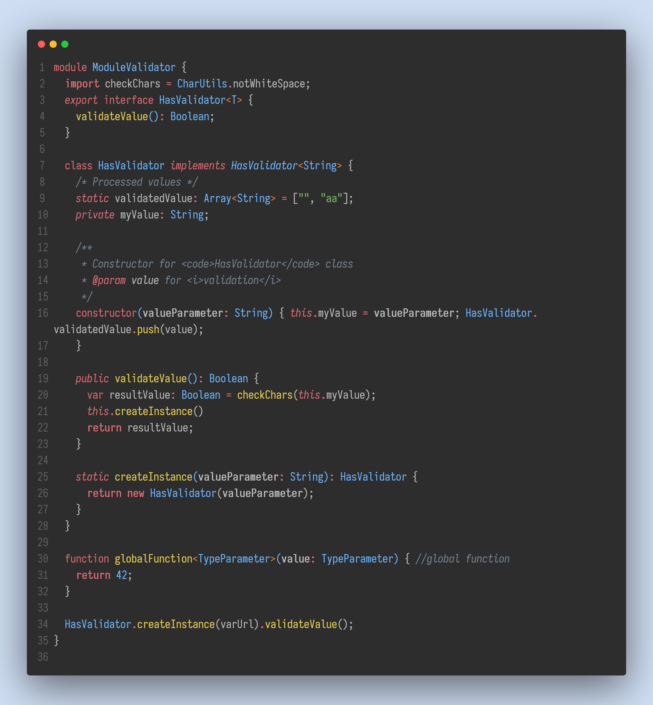

# README

VSCode Silver Gray Theme

**More new themes!**

Silver Usher Theme, Redefined workbench colors

Silver Dark Theme

Silver Gad Theme

## Screenshots

<!-- Silver Gray Theme

Silver Dark Theme

Silver Gad Theme

Silver Usher Theme

 -->

Silver Gray Syntax Color

Silver Usher Syntax Color

Silver Dark Syntax Color

Silver Gad Syntax Color

## References

[Usher]

[One Dark]

[Noctis]

[New Moon]

[Gad Valley]

[noctis]: https://marketplace.visualstudio.com/items?itemName=liviuschera.noctis
[tokyo night]: https://marketplace.visualstudio.com/items?itemName=enkia.tokyo-night
[gray gray gray]: https://marketplace.visualstudio.com/items?itemName=kendama1980.graygraygray
[usher]: https://usher.style/primitives/
[github light]: https://marketplace.visualstudio.com/items?itemName=Hyzeta.vscode-theme-github-light
[gad valley]: https://marketplace.visualstudio.com/items?itemName=dustypomerleau.Gad-valley
[new moon]: https://marketplace.visualstudio.com/items?itemName=taniarascia.new-moon-vscode
[an old hope]: https://marketplace.visualstudio.com/items?itemName=dustinsanders.an-old-hope-theme-vscode
[one dark]: https://github.com/joshdick/onedark.vim/blob/main/colors/onedark.vim
